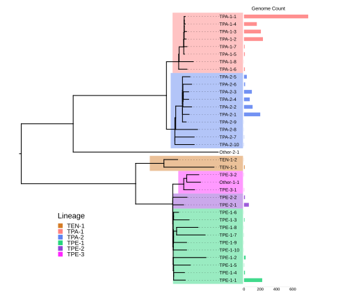

<p align="center">
  <picture>
    <source media="(prefers-color-scheme: dark)" srcset="assets/trepogeno-logo-dark.svg">
    
  </picture>
</p>

`trepogeno` is a molecular typing scheme and tool for classifying *Treponema pallidum* genomic data directly from sequencing reads.

## Overview
Most genomic data available for *Treponema pallidum* was generated directly from clinical specimens using hybrid capture enriched metagenomic sequencing methods. Sequencing depth is typically low and uneven, such that standard assembly methods often produce low quality assemblies. 

Although molecular typing tools exist for *T. pallidum* (e.g. multilocus sequence typing schemes; MLST), the clusters assigned are not always consistent with whole genome phylogeny. Moreover, typing methods such as MLST require recovery of complete locus sequences which is often not possible from *T. pallidum* assemblies (which may contain contig breaks or low quality base calls within target regions. A hierarchical SNP based typing scheme (based on the [GenoTyphi](https://github.com/typhoidgenomics/genotyphi) model) that requires only specific SNPs to be detected may therefore enable more consistent and robust typing from genomic data. 

### Hierarchical SNP types
As part of the *T. pallidum* NextStrain project, we used an initial dataset of 2313 genomes to delineate clusters at three hierarchical levels using [fastBAPS](https://github.com/gtonkinhill/fastbaps).

- Level 1 corresponds to the *T. pallidum* subspecies *pallidum* (TPA), *pertenue* (TPE), and *endemicum* (TEN). An additional group of genomes corresponding to outliers recovered from ancient DNA was left unclassified (Other).

- Level 2 corresponds to deep branches in the phylogeny, e.g. SS14 (TPA-1) and Nichols (TPA-2) lineages within TPA. Similarly deep branching lineages were observed within TPE. Numerical designations are applied to each group (largest group at each hierarchical level first).

- Level 3 corresponds to sublineages closer to the tips, and numbering is nested within higher levels (e.g. TPA-1-1, TPA-1-2). Since these were defined using BAPS, they are not uniformly diverse, and represent statistically robust genetic groups but not necessarily epidemiologically meaningful ones. Note that these clusters are generally more genetically diverse than those defined using SNP thresholds (e.g. from [Beale et al, 2021](https://www.nature.com/articles/s41564-021-01000-z)).


<p align="center"><sub><i>Whole genome phylogeny of 2313 T. pallidum genomes, showing <code>trepogeno</code> hierarchical lineages.</i></sub></p>


<br>



<p align="center"><sub><i>Collapsed phylogeny showing relationships between hierarchical clusters. Bar plots show genome counts for each sublineage.</i></sub></p>

<br>

### Discriminatory SNP typing
After defining hierarchical lineages, we identified highly discriminatory SNPs delineating the phylogenetic branches of each lineage and sublineage. Genomes containing these SNPs can thus be classified into the hierarchical scheme.


`trepogeno` wraps around and builds upon the well established tool [Mykrobe](https://github.com/Mykrobe-tools/mykrobe), and detects discriminatory SNPs to facilitate lineage calling of *Treponema pallidum* strains directly from sequencing reads. It can be installed as per the instructions below.

<br>

## Installation
### Quickstart with Docker or Singularity (Recommended)
**If your system has Docker** (to install see [Docker docs](https://docs.docker.com/desktop/))

Pull the image (replace `latest` with a specific version tag, e.g. `vX.X.X`, for a reproducible install):
```
docker pull quay.io/sanger-pathogens/trepogeno:latest
```
Run a `trepogeno` command, mounting your current working directory (or replace `$(pwd)` with the top-level directory where your data is stored):
```
docker run --rm -v $(pwd):/data -w /data quay.io/sanger-pathogens/trepogeno:latest trepogeno <params>
```
> [!IMPORTANT]
> You must supply only relative paths to your current working directory (or wherever you mounted in the above) in your `trepogeno` commands, the tool will not have access to your entire filesystem.

> [!TIP]
> To speed this up for repeated run you may wish to alias this in your `.bashrc` `.bash_profile` or whatever file runs on start up on your setup. Following this you can simply run `trepogeno <commands>` each time. Add the following line:
>```
>alias trepogeno='docker run --rm -v $(pwd):/data -w /data quay.io/sanger-pathogens/trepogeno:latest trepogeno'
>```


**If your system has Singularity/Apptainer** (to install see [Apptainer docs](https://apptainer.org/docs/admin/main/installation.html#)).

Note: Whilst these are the same tool, different systems have named. If you are using a managed system check which name applies to your install. Replace 'singularity' in the example below with 'apptainer' as appropriate.
Pull the image (replace TAG with your desired version `vX.X.X`)
```
singularity pull trepogeno_<TAG>.sif docker://quay.io/sanger-pathogens:<TAG>
```
Run directly with the pulled image:
```
singularity exec trepogeno_<TAG>.sif trepogeno --help
singularity exec trepogeno_<TAG>.sif trepogeno <params>
```
> [!TIP]
> Similarly to docker you may wish to alias the command to avoid typing out `singularity exec trepogeno_<TAG>.sif` each time (replace TAG and add the path to your .sif file):
> `alias trepogeno='singularity exec /path/to/trepogeno_<TAG>.sif trepogeno'`

### From source code
Note: this requires a way of creating an environment (e.g. conda, mamba) and a way to compile C (for macOS/Ubuntu: clang or gcc and make, Ubuntu will further require zlib1g-dev).

First clone the repository and its Mykrobe submodule:
```
git clone --recurse-submodules https://github.com/sanger-pathogens/trepogeno.git
cd trepogeno/trepogeno
```

Create an environment with Python 3.8 and install the dependencies defined in the pyproject.toml into it, for example with `conda`:
```
conda create -n trepogeno python=3.8
conda activate trepogeno
pip3 install -e .
```

Next, to ensure the McCortex binaries for Mykrobe compile correctly clone from the `geno_kmer_count` branch as below:

```
cd src/trepogeno/mykrobe
git clone --recurse-submodules -b geno_kmer_count https://github.com/Mykrobe-tools/mccortex mccortex
cd mccortex
make
cp bin/mccortex31 ../src/mykrobe/cortex
```

The `trepogeno` command should now be executable from anywhere, as long as the environment the dependencies are installed into is _activated_. You may check the installation by the help message:
```
trepogeno --help
```

## Usage
### Create typing scheme (deprecated)
The `deprecated/old_create_typing_scheme` subdirectory contains scripts relating to creating a typing scheme through use of rPinecone, a VCF, and a reference.
These scripts are deprecated and not used in normal execution of the tool.

### Create probe and lineage files
To create a probe and lineage file, required for lineage calling, you need a typing scheme and genomic reference.
For more information on creating a typing scheme, refer to the [Typing Scheme Guide](./docs/typing_scheme_guide.md).


Example command:
```
trepogeno \
--json_directory files/json_outputs \
--type_scheme data/2026-05-12__07_masked_snpsAF09DP5_n10.diagnostic_SNPs_Mykrobe_2026-08-04_b.tsv \
--genomic_reference data/Treponema_pallidum_subsp_pallidum_SS14_v2.fa \
--probe_prefix files/probes/custom_probe_name \
--make_probes
```
Expected outputs:
- custom_typing.fa
- custom_typing.json

### Lineage calling
You will need the lineage and probe files made by Mykrobe, and either a manifest containing paths to the reads you want called, or a single --read1/--read2 pair.

Example manifest with two query inputs:
```
ID,R1,R2
sampleA,/data/sampleA_1.fastq.gz,/data/sampleA_2.fastq.gz
sampleB,/data/sampleB_1.fastq.gz,/data/sampleB_2.fastq.gz
```

Example commands:
```
trepogeno \
--json_directory files/json_outputs \
--probe_prefix files/probes/custom_probe_name \
--seq_manifest /data/manifest.csv \
--lineage_call
```

Or, to call a single sample directly without a manifest:
```
trepogeno \
--json_directory files/json_outputs \
--probe_prefix files/probes/custom_probe_name \
--read1 /data/sample_1.fastq.gz \
--read2 /data/sample_2.fastq.gz \
--sample_id sample_name \
--lineage_call
```

Expected outputs:
- sample.json (one per sample)

### Process and summarise the Mykrobe outputs
You need to supply the path to the directory containing the Mykrobe output JSON files.

```
trepogeno \
--json_directory files/json_outputs \
--tabulate_jsons
```

### Example full run execution

```
trepogeno \
--json_directory files/json_outputs \
--type_scheme data/2026-05-12__07_masked_snpsAF09DP5_n10.diagnostic_SNPs_Mykrobe_2026-08-04_b.tsv \
--genomic_reference data/Treponema_pallidum_subsp_pallidum_SS14_v2.fa \
--probe_prefix files/probes/custom_probes \
--make_probes \
--seq_manifest /data/manifest.csv \
--tabulate_jsons \
--lineage_call
```

## Parameters

```
Make Probes
-----------
--make_probes   
    Used to indicate you wish to generate a new set of probes during the work flow

--type_scheme   
    Path to the file that maps SNPs to specific genomic coordinates and lineages, to learn more review mykrobe's custom lineage calling documentation.

--genomic_reference 
    A FASTA file that acts as the genomic reference; must match the reference used in the typing scheme

--probe_prefix
    Path prefix (without extension) for the probe and lineage files to write, e.g. files/probes/custom writes files/probes/custom.fa and files/probes/custom.json. Defaults to ./probes

--kmer_size 
    what kmer size to use when creating the probes. defaults to 21

Lineage Calling
-----------
--lineage_call  
    Used to indicate you wish to execute the lineage calling workflow

--json_directory    
    A path to the directory for mykrobe to save its JSON files after calling a lineage. These will be named based on the ID supplied in the manifest, e.g. SRR567232.json

--seq_manifest (required, unless using --read1)
    A 3-column comma-separated value (CSV) table file of Sample ID, path to read 1 and path to read 2, with header. If using single-end reads, leave a trailing comma, e.g. 'ReadID,/fastq/ReadID1.fastq,'

--read1 (required, unless using --seq_manifest)
    Path to a fastq file to call a single sample directly, instead of via a manifest. Provide either --seq_manifest or --read1, not both.

--read2 (optional)
    Path to the second fastq of a pair, if using --read1. Omit for single-end reads.

--sample_id (required if using --read1)
    Sample ID to use when calling a single sample directly with --read1/--read2.

--probe_prefix
    Path prefix (without extension) of the probe.fa and lineage.json files to read, e.g. files/probes/custom reads files/probes/custom.fa and files/probes/custom.json. Defaults to ./probes. The kmer size used is read automatically from the probe file, so it does not need to be supplied separately.

Json Processing
-----------
--tabulate_jsons    
    Used to indicate you wish to execute the workflow to tabulate the output from mykrobe

--json_directory    
    Supply a path to the directory containing mykrobe summary JSON files; these should be in the format mykrobe uses when `--report_all_calls` is used in mykrobe (the default if you only use trepogeno)
```

### Schematic Overview


<br>

## Results
The JSON files contain detailed information about each SNP called for each sample tested. When using `--tabulate_jsons`, several summary files are produced which summarise findings across all JSON files provided. The most useful of these is `lineage_call_summary.csv`:

| sample | called_lineage | n_called_lineages | all_called_lineages | primary_path_concordance | flag_reason | sublineage_resolved | path_support | node_scores | terminal_use_ref_allele | terminal_n_markers | terminal_n_concordant | terminal_n_het | terminal_n_discordant | terminal_node_concordance | terminal_mean_conf | terminal_min_conf | terminal_conf_qual | genome_depth |
|---|---|---|---|---|---|---|---|---|---|---|---|---|---|---|---|---|---|---|
| ERR5210584 | TPA.1.6 | 1 | TPA.1.6(1.0) | 1.0 | | yes | 3/3 | TPA=1;TPA.1=1;TPA.1.6=1 | False | 1 | 1 | 0 | 0 | 1.0 | 24524 | 24524 | high | 226 |
| ERR13170795 | TPA.1.6 | 1 | TPA.1.6(1.0) | 1.0 | | yes | 3/3 | TPA=1;TPA.1=1;TPA.1.6=1 | False | 1 | 1 | 0 | 0 | 1.0 | 87315 | 87315 | high | 457 |

### Interpreting the output
Both samples above were called as **TPA.1.6** with full confidence: `primary_path_concordance` is `1.0` (every marker along the called path was concordant with the expected allele), `sublineage_resolved` is `yes` (the call reached a genuine terminal leaf rather than stopping at an internal node with an unresolved sub-lineage), and `terminal_conf_qual` is `high`, backed by strong per-marker evidence (`terminal_min_conf` in the tens of thousands). `flag_reason` is empty for both (low coverage or anomalous SNPs would lead to a flag here).

A weaker or more ambiguous call would look different: `flag_reason` may show `low_node_concordance` (the terminal call rests on a minority of its markers, e.g. via a shared/homoplasic SNP) or `low_conf` (weak overall evidence, e.g. a single marker at low sequencing depth). For ambiguous or uncertain calls, `called_lineage` is prefixed with `*`. `all_called_lineages` lists every lineage mykrobe found any support for, each with its own `path_concordance` score in parentheses — this may be useful for spotting cases where a sample matches more than one path.

### Column reference

| Column | Description |
|---|---|
| `sample` | The sample ID, taken from the input JSON filename (or manifest ID). |
| `called_lineage` | The primary lineage call. Prefixed with `*` (mlst-style) when the call is flagged as low-confidence — see `flag_reason` below. |
| `n_called_lineages` | The number of distinct lineages mykrobe found any support for in this sample. Usually 1; higher values indicate mykrobe detected markers for more than one candidate path (see `all_called_lineages`). |
| `all_called_lineages` | Every lineage mykrobe found support for, each annotated with its own `path_concordance` score in parentheses (e.g. `TPA.1.6(1.0);TPA.2(0.3)`), ordered best-first. Useful for judging how much stronger the primary call is than any runner-up. |
| `primary_path_concordance` | The mean fraction of concordant markers across every node on the primary call's path (e.g. TPA → TPA.1 → TPA.1.6), where mykrobe's own path score can be misleadingly perfect on as few as one stray marker. A score of `1.0` means every node on the path was fully supported; lower scores indicate at least one weakly-supported node. |
| `flag_reason` | Why a call was flagged low-confidence, if at all: `low_node_concordance` (the terminal call rests on a minority of its own markers, e.g. a shared/homoplasic SNP) and/or `low_conf` (weak overall evidence, e.g. a single marker at low depth). Empty if the call is confident. |
| `sublineage_resolved` | `yes` if the call reached a genuine terminal leaf of the typing scheme; `no` if it stopped at an internal node with deeper sub-lineages defined in the scheme but lacked markers to resolve which one. |
| `path_support` | Mykrobe's own `good_nodes/tree_depth` score for the primary path — the number of hierarchy levels with at least one concordant marker, out of the total depth of the path. |
| `node_scores` | The per-level genotype score along the primary path (e.g. `TPA=1;TPA.1=1;TPA.1.6=1`), where `1` = concordant, `0.5` = heterozygous, `0` = discordant. |
| `terminal_use_ref_allele` | Whether the terminal (deepest called) lineage is defined by the *reference* allele (`True`) or the *alternate* allele (`False`) — taken from the `*` prefix in the typing scheme TSV if `--type_scheme` was supplied, otherwise inferred from the dominant genotype. |
| `terminal_n_markers` | The number of SNP markers/probes associated with the terminal called lineage. |
| `terminal_n_concordant` | The number of terminal markers concordant with the expected allele. |
| `terminal_n_het` | The number of terminal markers that were heterozygous. |
| `terminal_n_discordant` | The number of terminal markers discordant with the expected allele. |
| `terminal_node_concordance` | `(n_concordant + 0.5 × n_het) / n_markers` for the terminal node specifically. Low values mean the terminal call rests on only a minority of its own defining markers. |
| `terminal_mean_conf` | The mean log-likelihood-ratio confidence (mykrobe's `info.conf`) across the terminal node's concordant/het markers. |
| `terminal_min_conf` | The minimum (weakest-link) log-likelihood-ratio confidence among the terminal node's markers — the marker most likely to undermine the call. |
| `terminal_conf_qual` | A qualitative band (`high` / `moderate` / `low`) derived from `terminal_min_conf`, for an at-a-glance read on evidence strength. |
| `genome_depth` | The median expected k-mer depth across the genome (from mykrobe's `info.expected_depths`) — a general sequencing-depth indicator, not specific to the called lineage. |

<br>

## Scheme Updates
We anticipate that as new genomes are published, new sublineages may need to be designated. Substantially divergent phylogenetic outliers will be identified through community maintenance of the Nextstrain build, and will be discussed before designating a new lineage or sublineage. Updated schemes will be devised and made available [here](https://github.com/sanger-pathogens/trepogeno/tree/main/data/scheme_updates) - the latest scheme build can be downloaded [here](https://raw.githubusercontent.com/sanger-pathogens/trepogeno/main/data/scheme_updates/Trepogeno_scheme_build_2026-08-04.tar.gz).

<br>

## Acknowledgements
This project was heavily inspired by excellent work from the [GenoTyphi](https://github.com/typhoidgenomics/genotyphi) and [Mykrobe](https://github.com/Mykrobe-tools/mykrobe) teams and makes use of their code. The scheme was developed using data from the *T. pallidum* Nextstrain build.

`trepogeno` was developed by [Mat Beale](https://www.sanger.ac.uk/person/beale-mathew/) and the [PAM-Informatics](https://www.sanger.ac.uk/group/parasites-and-microbes-informatics/) team at the [Wellcome Sanger Institute](https://www.sanger.ac.uk/programme/parasites-and-microbes/) in collaboration with the *T. pallidum* Nextstrain project led by [Nicole Lieberman](https://dlmp.uw.edu/faculty/lieberman-nicole) at the [University of Washington](https://www.washington.edu/). Special thanks to Jason Beard who supported the initial design and coding of the project. 

This work was funded by the [Gates Foundation](https://www.gatesfoundation.org/) (INV-072205) and [Wellcome](https://wellcome.org/) (206545/Z/17/Z). 
