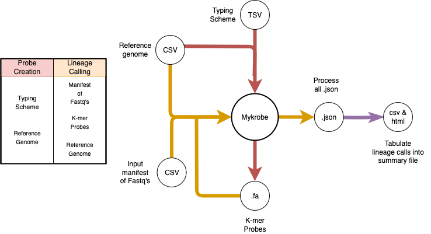

<p align="center">
  <picture>
    <source media="(prefers-color-scheme: dark)" srcset="assets/trepogeno-logo-dark.svg">
    
  </picture>
</p>

Trepogeno wraps around and builds upon the tool [Mykrobe](https://github.com/Mykrobe-tools/mykrobe) to facilitate lineage calling of *Treponema pallidum* strains. It can be installed as per the below instructions.

[[TOC]]

## Installation
### From source code
First clone the repository and it's Mykrobe submodule:
```
git clone --recurse-submodules https://github.com/sanger-pathogens/trepogeno.git
cd trepogeno/trepogeno
```

Create an environment with Python 3.8 and install the dependencies defined in the pyproject.toml into it, for example with `conda`:
```
conda create -n trepogeno python=3.8
conda activate trepogeno
pip3 install -e .
```

Next, to ensure the McCortex binaries for Mykrobe compile correctly clone from the `geno_kmer_count` branch as below:

```
cd src/trepogeno/mykrobe
git clone --recurse-submodules -b geno_kmer_count https://github.com/Mykrobe-tools/mccortex mccortex
cd mccortex
make
cp bin/mccortex31 ../src/mykrobe/cortex
```

The trepogeno command should now be executable from anywhere, as long as the environment the dependencies are installed into is _activated_. You may check the installation by the help message:
```
trepogeno --help
```

## Usage
### Create typing scheme (deprecated)
The `deprecated/old_create_typing_scheme` subdirectory contains scripts relating to creating a typing scheme through use of rPinecone, a VCF, and a reference.
These scripts are deprecated and not used in normal execution of the tool.

### Create probe and lineage files
To create a probe and lineage file, required for lineage calling, you need a typing scheme and genomic reference.
For more information on creating a typing scheme, refer to the [Typing Scheme Guide](./docs/typing_scheme_guide.md).


Example command:
```
trepogeno \
--json_directory files/json_outputs \
--type_scheme data/2026-05-12__07_masked_snpsAF09DP5_n10.diagnostic_SNPs_Mykrobe_2026-08-04_b.tsv \
--genomic_reference data/Treponema_pallidum_subsp_pallidum_SS14_v2.fa \
--probe_prefix files/probes/custom_probe_name \
--make_probes
```
Expected outputs:
- custom_typing.fa
- custom_typing.json

### Lineage calling
You will need the lineage and probe files made by Mykrobe, and either a manifest containing paths to the reads you want called, or a single --read1/--read2 pair.

Example commands:
```
trepogeno \
--json_directory files/json_outputs \
--probe_prefix files/probes/custom_probe_name \
--seq_manifest /data/nexstrain/manifest.csv \
--lineage_call
```

Or, to call a single sample directly without a manifest:
```
trepogeno \
--json_directory files/json_outputs \
--probe_prefix files/probes/custom_probe_name \
--read1 /data/nexstrain/sample_1.fastq.gz \
--read2 /data/nexstrain/sample_2.fastq.gz \
--sample_id sample_name \
--lineage_call
```

Expected outputs:
- sample.json (one per sample)

### Process and summarise the Mykrobe outputs
You need to supply the path to the directory containing the Mykrobe output JSON files.

```
trepogeno \
--json_directory files/json_outputs \
--tabulate_jsons
```

### Example full run execution

```
trepogeno \
--json_directory files/json_outputs \
--type_scheme data/2026-05-12__07_masked_snpsAF09DP5_n10.diagnostic_SNPs_Mykrobe_2026-08-04_b.tsv \
--genomic_reference data/Treponema_pallidum_subsp_pallidum_SS14_v2.fa \
--probe_prefix files/probes/custom_probes \
--make_probes \
--seq_manifest /data/nexstrain/manifest.csv \
--tabulate_jsons \
--lineage_call
```

## Parameters

```
Make Probes
-----------
--make_probes   
    Used to indicate you wish to generate a new set of probes during the work flow

--type_scheme   
    Path to the file that maps SNPs to specific genomic coordinates and lineages, to learn more review mykrobe's custom lineage calling documentation.

--genomic_reference 
    A FASTA file that acts as the genomic reference; must match the reference used in the typing scheme

--probe_prefix
    Path prefix (without extension) for the probe and lineage files to write, e.g. files/probes/custom writes files/probes/custom.fa and files/probes/custom.json. Defaults to ./probes

--kmer_size 
    what kmer size to use when creating the probes. defaults to 21

Lineage Calling
-----------
--lineage_call  
    Used to indicate you wish to execute the lineage calling workflow

--json_directory    
    A path to the directory for mykrobe to save its JSON files after calling a lineage. These will be named based on the ID supplied in the manifest, e.g. SRR567232.json

--seq_manifest (required, unless using --read1)
    A 3-column CSV of Sample ID, path to read 1 and path to read 2, with header. If using single-end reads, leave a trailing comma, e.g. 'ReadID,/fastq/ReadID1.fastq,'

--read1 (required, unless using --seq_manifest)
    Path to a fastq file to call a single sample directly, instead of via a manifest. Provide either --seq_manifest or --read1, not both.

--read2 (optional)
    Path to the second fastq of a pair, if using --read1. Omit for single-end reads.

--sample_id (required if using --read1)
    Sample ID to use when calling a single sample directly with --read1/--read2.

--probe_prefix
    Path prefix (without extension) of the probe.fa and lineage.json files to read, e.g. files/probes/custom reads files/probes/custom.fa and files/probes/custom.json. Defaults to ./probes. The kmer size used is read automatically from the probe file, so it does not need to be supplied separately.

Json Processing
-----------
--tabulate_jsons    
    Used to indicate you wish to execute the workflow to tabulate the output from mykrobe

--json_directory    
    Supply a path to the directory containing mykrobe summary JSON files; these should be in the format mykrobe uses when `--report_all_calls` is used in mykrobe (the default if you only use trepogeno)
```

### Schematic Overview

